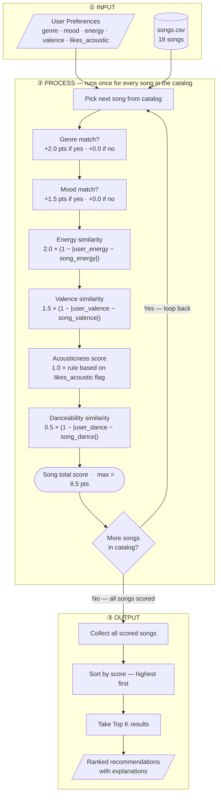
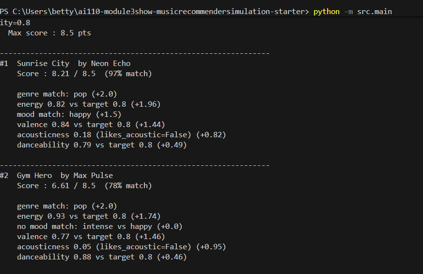
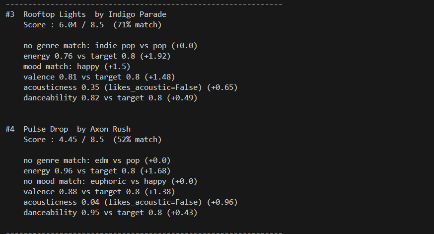
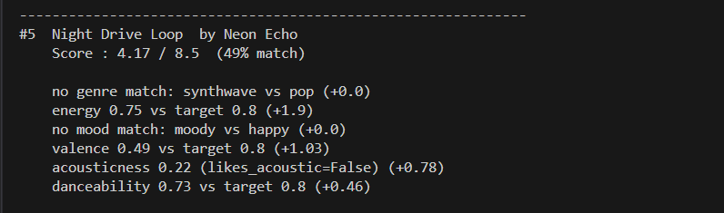

# 🎵 Music Recommender Simulation

## Project Summary

In this project you will build and explain a small music recommender system.

Your goal is to:

- Represent songs and a user "taste profile" as data
- Design a scoring rule that turns that data into recommendations
- Evaluate what your system gets right and wrong
- Reflect on how this mirrors real world AI recommenders

Replace this paragraph with your own summary of what your version does.

---

## How The System Works

Real-world recommendation systems like Spotify and YouTube learn from the behavior of millions of users — tracking plays, skips, and saves — to predict what any one person might enjoy next. This approach, called collaborative filtering, is powerful but requires enormous amounts of behavioral data to work well. This simulation takes a different and more transparent approach: content-based filtering. Instead of comparing users to each other, it compares the attributes of songs directly to a user's stated preferences. Each song is described by measurable features like energy and genre, and each user profile stores their ideal values for those same features. A scoring function then measures how closely each song matches the user's taste — so a user who prefers low-energy, acoustic music will consistently score calm, acoustic tracks higher than high-energy electronic ones. Songs are ranked by their total score, and the top results become the recommendations. This makes the system simple, explainable, and easy to reason about, even though it cannot discover the kind of surprising cross-genre connections that behavioral data unlocks.

---

### The Dataset

The catalog is stored in `data/songs.csv` and contains **18 songs** spanning a wide range of genres and moods. The starter set of 10 songs was expanded to cover genres and moods that were missing from the original, giving the scoring logic more meaningful contrast to work with.

**Genres covered:** pop, lofi, rock, ambient, jazz, synthwave, indie pop, hip-hop, classical, edm, country, r&b, metal, soul, reggae

**Moods covered:** happy, chill, intense, relaxed, moody, focused, sad, melancholic, euphoric, nostalgic, romantic, aggressive

Each `Song` object stores the following attributes:

| Field | Type | Role |
|---|---|---|
| `id` | int | Internal identifier only |
| `title` | str | Display only |
| `artist` | str | Display and diversity filtering |
| `genre` | str | Categorical — scored by exact match |
| `mood` | str | Categorical — scored by exact match |
| `energy` | float 0–1 | Perceptual intensity; scored by proximity to user target |
| `tempo_bpm` | float | Beats per minute; excluded from scoring until normalized |
| `valence` | float 0–1 | Musical positivity; scored by proximity to user target |
| `danceability` | float 0–1 | Rhythmic regularity; scored by proximity to user target |
| `acousticness` | float 0–1 | Acoustic vs. electronic texture; scored by rule |

---

### The User Profile

Each user is represented as a dictionary (or `UserProfile` dataclass) with five fields that map directly to the features scored in the algorithm:

```python
user_prefs = {
    "genre":    "lofi",    # favorite genre — matched categorically
    "mood":     "chill",   # favorite mood  — matched categorically
    "energy":   0.40,      # target energy  — songs scored by proximity to this value
    "valence":  0.58,      # target valence — songs scored by proximity to this value
    "acoustic": True,      # texture preference — True rewards high acousticness
}
```

`target_energy` and `target_valence` use proximity scoring rather than directional scoring. A user with `energy: 0.40` does not want the highest or lowest energy song — they want the song *closest* to 0.40. This is the key design decision that makes numerical features meaningful.

---

### The Algorithm Recipe

The recommender runs in two stages: a **scoring stage** that evaluates every song individually, and a **ranking stage** that orders all results and selects the top K.

#### Stage 1 — Score a Single Song

Each song earns points across six features. The maximum possible score is **8.5 points**.

| Feature | Max pts | Method |
|---|---|---|
| `genre` | 2.0 | +2.0 for exact match · +0.0 otherwise |
| `energy` | 2.0 | `2.0 × (1 − abs(user_energy − song_energy))` |
| `mood` | 1.5 | +1.5 for exact match · +0.0 otherwise |
| `valence` | 1.5 | `1.5 × (1 − abs(user_valence − song_valence))` |
| `acousticness` | 1.0 | `1.0 × song_acousticness` if `acoustic=True`, else `1.0 × (1 − song_acousticness)` |
| `danceability` | 0.5 | `0.5 × (1 − abs(user_dance − song_danceability))` |

The similarity formula for every numerical feature follows the same pattern:

```
feature_points = max_points × (1 − |user_target − song_value|)
```

A song that exactly matches the user's target earns the full points. A song at the opposite extreme earns zero. Every song earns *some* points on every numeric feature — the formula produces degrees of fit, not binary pass or fail.

**Why genre outweighs mood (2.0 vs 1.5):** Genre is a structural sonic constraint — rock and lofi are not interchangeable regardless of mood. Mood is an emotional texture that varies *within* a genre. Additionally, mood and energy are partially redundant in this catalog (intense moods cluster at high energy, chill moods cluster at low energy), so giving mood full genre-level weight would double-count the signal already captured by energy proximity.

#### Stage 2 — Rank All Songs

```
1. Score every song in the catalog using Stage 1
2. Collect all (song, score) pairs
3. Sort by score — highest first
4. Optionally filter: remove songs below a minimum score threshold
5. Return the top K results with scores and explanations
```

#### Data Flow
.png)

---

### Sample Output

Running `python -m src.main` with the default `pop / happy` profile produces:




```
Loaded songs: 18

==============================================================
  Music Recommender  --  Top 5 Results
==============================================================

  Profile   : genre=pop  |  mood=happy  |  energy=0.8  |  valence=0.8  |  acoustic=False  |  danceability=0.8
  Max score : 8.5 pts

--------------------------------------------------------------
#1  Sunrise City  by Neon Echo
    Score : 8.21 / 8.5  (97% match)

    genre match: pop (+2.0)
    energy 0.82 vs target 0.8 (+1.96)
    mood match: happy (+1.5)
    valence 0.84 vs target 0.8 (+1.44)
    acousticness 0.18 (likes_acoustic=False) (+0.82)
    danceability 0.79 vs target 0.8 (+0.49)

--------------------------------------------------------------
#2  Gym Hero  by Max Pulse
    Score : 6.61 / 8.5  (78% match)

    genre match: pop (+2.0)
    energy 0.93 vs target 0.8 (+1.74)
    no mood match: intense vs happy (+0.0)
    valence 0.77 vs target 0.8 (+1.46)
    acousticness 0.05 (likes_acoustic=False) (+0.95)
    danceability 0.88 vs target 0.8 (+0.46)

--------------------------------------------------------------
#3  Rooftop Lights  by Indigo Parade
    Score : 6.04 / 8.5  (71% match)

    no genre match: indie pop vs pop (+0.0)
    energy 0.76 vs target 0.8 (+1.92)
    mood match: happy (+1.5)
    valence 0.81 vs target 0.8 (+1.48)
    acousticness 0.35 (likes_acoustic=False) (+0.65)
    danceability 0.82 vs target 0.8 (+0.49)

--------------------------------------------------------------
#4  Pulse Drop  by Axon Rush
    Score : 4.45 / 8.5  (52% match)

    no genre match: edm vs pop (+0.0)
    energy 0.96 vs target 0.8 (+1.68)
    no mood match: euphoric vs happy (+0.0)
    valence 0.88 vs target 0.8 (+1.38)
    acousticness 0.04 (likes_acoustic=False) (+0.96)
    danceability 0.95 vs target 0.8 (+0.43)

--------------------------------------------------------------
#5  Night Drive Loop  by Neon Echo
    Score : 4.17 / 8.5  (49% match)

    no genre match: synthwave vs pop (+0.0)
    energy 0.75 vs target 0.8 (+1.9)
    no mood match: moody vs happy (+0.0)
    valence 0.49 vs target 0.8 (+1.03)
    acousticness 0.22 (likes_acoustic=False) (+0.78)
    danceability 0.73 vs target 0.8 (+0.46)

==============================================================
```

---

### Known Biases and Limitations

**Genre dominance.** At 2.0 points, a genre match contributes nearly a quarter of the maximum possible score on its own. A song that perfectly matches the user's energy, mood, valence, and acoustic preference but belongs to a different genre can be outscored by a mediocre genre match. For example, a user who sets `genre: rock` and `energy: 0.40` might receive a weak rock song (scoring ~5.0) ranked above a metal track (energy 0.98, scoring ~4.5) even though the metal track is sonically closer to what they described. Genre is a useful filter but should not be the deciding factor when numeric features disagree strongly.

**Categorical mood is all-or-nothing.** A `mood` mismatch deducts the full 1.5 points with no gradient. A user who wants "intense" receives the same zero mood score for both "aggressive" (very similar) and "romantic" (very different). Mood would be more accurate as a proximity score over a mood-similarity matrix, not a binary match.

**No negative preferences.** The profile can only express what a user wants, not what they dislike. A user who finds country music unpleasant has no way to penalize it — country songs will still accumulate energy and valence points and could surface in the top K.

**Static profile, single context.** The same user profile is used for every query regardless of time of day, activity, or listening context. A real recommender would adapt: the same person might want lo-fi at 2pm and metal at 6pm. This system treats taste as fixed.

**Tiny catalog.** With 18 songs, results are sensitive to small changes in weights. A single point adjustment can completely reorder the top 5. Results should not be over-interpreted as evidence that the algorithm generalizes.

---

## Getting Started

### Setup

1. Create a virtual environment (optional but recommended):

   ```bash
   python -m venv .venv
   source .venv/bin/activate      # Mac or Linux
   .venv\Scripts\activate         # Windows

2. Install dependencies

```bash
pip install -r requirements.txt
```

3. Run the app:

```bash
python -m src.main
```

### Running Tests

Run the starter tests with:

```bash
pytest
```

You can add more tests in `tests/test_recommender.py`.

---

## Experiments You Tried

Use this section to document the experiments you ran. For example:

- What happened when you changed the weight on genre from 2.0 to 0.5
- What happened when you added tempo or valence to the score
- How did your system behave for different types of users

---

## Limitations and Risks

Summarize some limitations of your recommender.

Examples:

- It only works on a tiny catalog
- It does not understand lyrics or language
- It might over favor one genre or mood

You will go deeper on this in your model card.

---

## Reflection

Read and complete `model_card.md`:

[**Model Card**](model_card.md)

Write 1 to 2 paragraphs here about what you learned:

- about how recommenders turn data into predictions
- about where bias or unfairness could show up in systems like this


---

## 7. `model_card_template.md`

Combines reflection and model card framing from the Module 3 guidance. :contentReference[oaicite:2]{index=2}  

```markdown
# 🎧 Model Card - Music Recommender Simulation

## 1. Model Name

Give your recommender a name, for example:

> VibeFinder 1.0

---

## 2. Intended Use

- What is this system trying to do
- Who is it for

Example:

> This model suggests 3 to 5 songs from a small catalog based on a user's preferred genre, mood, and energy level. It is for classroom exploration only, not for real users.

---

## 3. How It Works (Short Explanation)

Describe your scoring logic in plain language.

- What features of each song does it consider
- What information about the user does it use
- How does it turn those into a number

Try to avoid code in this section, treat it like an explanation to a non programmer.

---

## 4. Data

Describe your dataset.

- How many songs are in `data/songs.csv`
- Did you add or remove any songs
- What kinds of genres or moods are represented
- Whose taste does this data mostly reflect

---

## 5. Strengths

Where does your recommender work well

You can think about:
- Situations where the top results "felt right"
- Particular user profiles it served well
- Simplicity or transparency benefits

---

## 6. Limitations and Bias

Where does your recommender struggle

Some prompts:
- Does it ignore some genres or moods
- Does it treat all users as if they have the same taste shape
- Is it biased toward high energy or one genre by default
- How could this be unfair if used in a real product

---

## 7. Evaluation

How did you check your system

Examples:
- You tried multiple user profiles and wrote down whether the results matched your expectations
- You compared your simulation to what a real app like Spotify or YouTube tends to recommend
- You wrote tests for your scoring logic

You do not need a numeric metric, but if you used one, explain what it measures.

---

## 8. Future Work

If you had more time, how would you improve this recommender

Examples:

- Add support for multiple users and "group vibe" recommendations
- Balance diversity of songs instead of always picking the closest match
- Use more features, like tempo ranges or lyric themes

---

## 9. Personal Reflection

A few sentences about what you learned:

- What surprised you about how your system behaved
- How did building this change how you think about real music recommenders
- Where do you think human judgment still matters, even if the model seems "smart"

